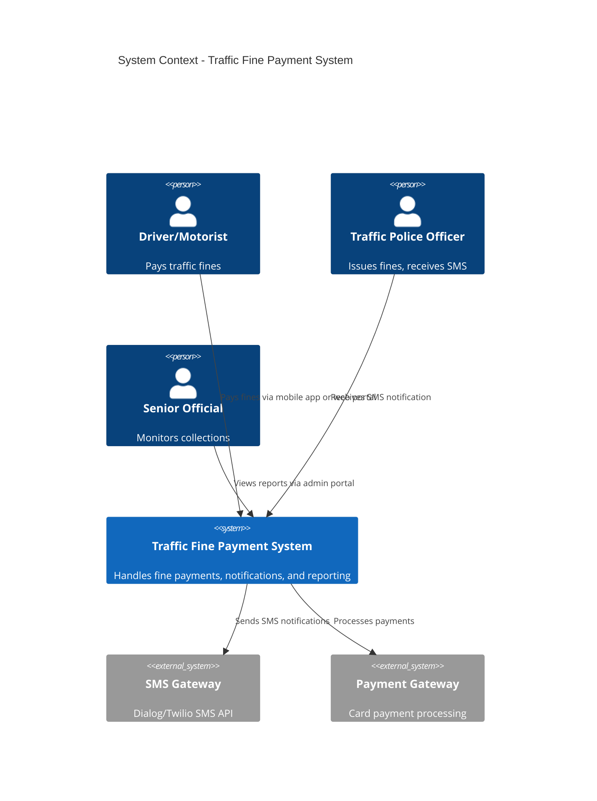
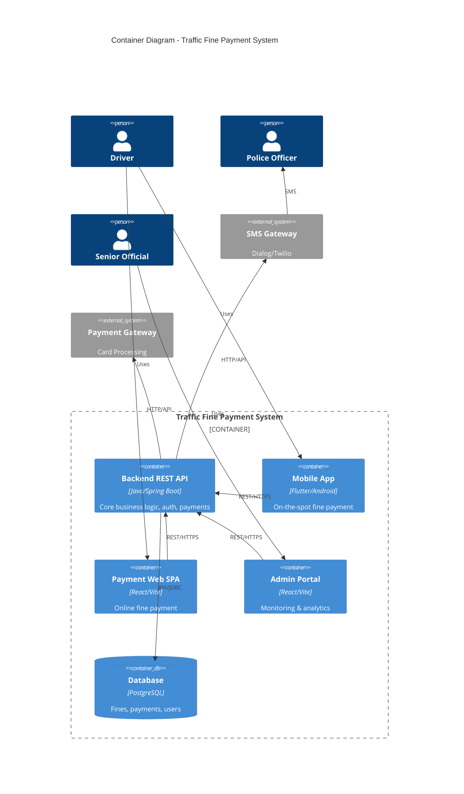
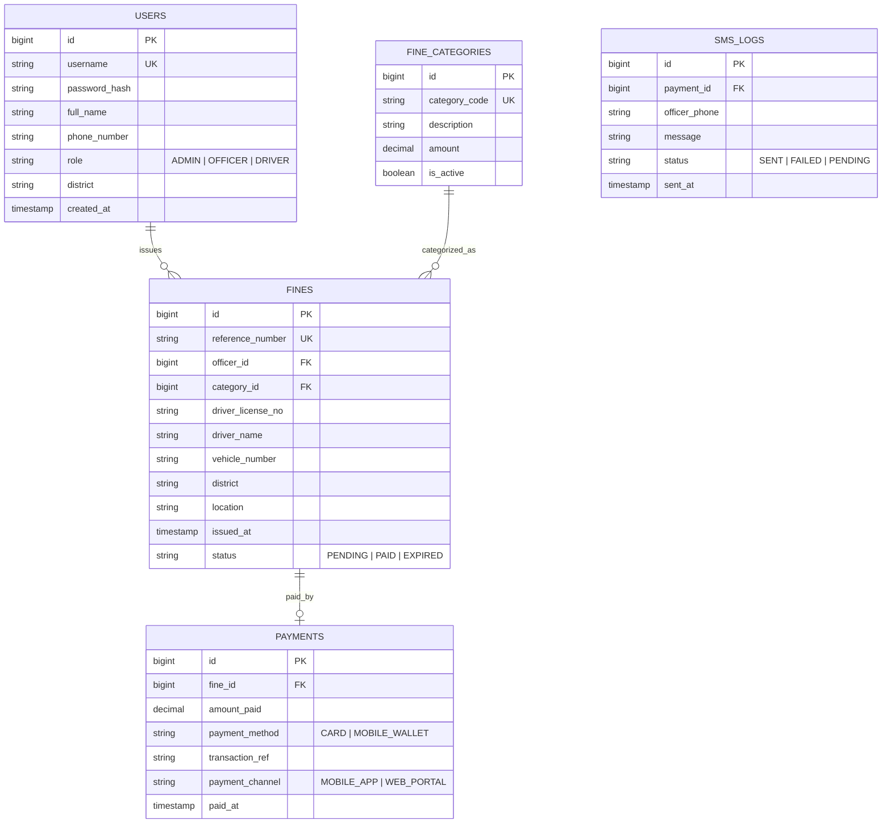
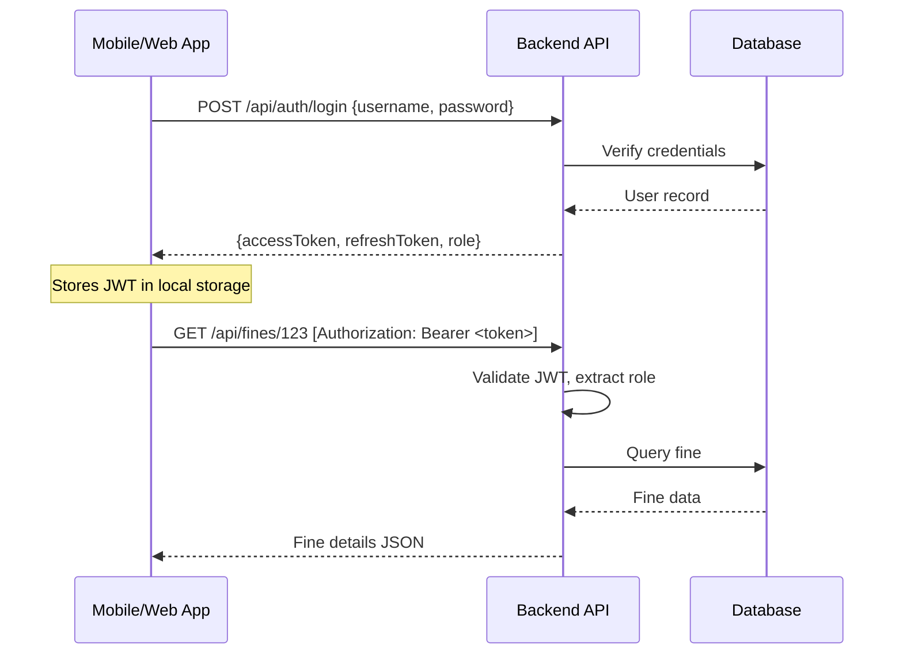
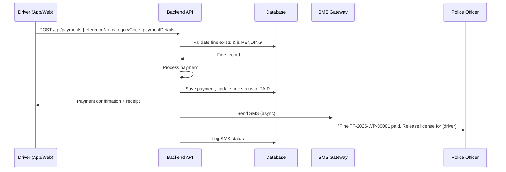

# Sri Lanka Police Traffic Fine Payment System — Implementation Plan

## 1. Project Overview

A digital traffic fine payment system for the Sri Lanka Police Department consisting of:

| Component | Type | Purpose |
|-----------|------|---------|
| **Backend REST API** | Java / Spring Boot | Core business logic, auth, payment processing |
| **Android Mobile App** | Flutter | On-the-spot fine payment by drivers |
| **Payment Web SPA** | React (Vite) | Online fine payment portal for drivers |
| **Admin Web Portal** | React (Vite) | Monitoring & analytics for senior officials |
| **SMS Service** | Spring Boot + Twilio/Dialog | Notify officers upon payment |
| **Database** | PostgreSQL + JPA/Hibernate | Persistent storage |

---

## 2. Architecture & Module Alignment

Since this is for a **Software Architecture** module, the documentation and architectural thinking is **equally important** as the code. The plan maps deliverables to module topics:

| Module Topic | How We Address It |
|---|---|
| NFRs & Trade-off Analysis | Documented NFRs (performance, security, scalability) with trade-off ADRs |
| ADRs | At least 5 Architecture Decision Records (tech choices, auth strategy, DB choice, etc.) |
| Clean Architecture (Ports & Adapters) | Backend layered as Controller → Service → Repository with clear boundaries |
| C4 Model | Full C4 diagrams (Context, Container, Component) using Mermaid.js |
| Docs-as-Code | All diagrams in Mermaid.js committed to repo |
| Architectural Styles | Modular monolith backend with clear module boundaries; discuss microservices trade-offs in ADR |
| Design Patterns | API Gateway (BFF pattern for mobile vs web), Circuit Breaker (SMS), CQRS (admin reads vs writes) |
| JWT Auth | Spring Security + JWT token-based authentication |
| Coupling & Cohesion | Demonstrate through package structure and interface-based design |

---

## 3. System Architecture

### 3.1 C4 Context Diagram (Level 1)



### 3.2 C4 Container Diagram (Level 2)



### 3.3 High-Level Architecture Style

We adopt a **Modular Monolith** for the backend with Clean Architecture layers:

```
┌─────────────────────────────────────────────────────────┐
│                    Backend REST API                      │
│                                                         │
│  ┌──────────┐  ┌──────────┐  ┌──────────┐  ┌────────┐  │
│  │   Auth   │  │   Fine   │  │ Payment  │  │  SMS   │  │
│  │  Module  │  │  Module  │  │  Module  │  │ Module │  │
│  └────┬─────┘  └────┬─────┘  └────┬─────┘  └───┬────┘  │
│       │              │              │             │      │
│  ┌────┴──────────────┴──────────────┴─────────────┴──┐  │
│  │              Shared Domain Layer                    │  │
│  │         (Entities, Value Objects, DTOs)             │  │
│  └────────────────────┬──────────────────────────────┘  │
│                       │                                  │
│  ┌────────────────────┴──────────────────────────────┐  │
│  │          Infrastructure Layer (JPA, SMS Client)    │  │
│  └───────────────────────────────────────────────────┘  │
└─────────────────────────────────────────────────────────┘
```

> [!IMPORTANT]
> **Why Modular Monolith over Microservices?** For a student project with 6 members, a modular monolith provides clear boundaries without the operational complexity of distributed systems. This trade-off should be documented as an **ADR**. The modules are structured so they *could* be extracted to microservices later (Strangler Fig Pattern readiness).

---

## 4. Database Design

### 4.1 ER Diagram



### 4.2 Key Design Decisions

- **reference_number**: Unique alphanumeric code printed on the physical fine sheet (e.g., `TF-2026-WP-00001`)
- **category_code**: Maps to fine type (e.g., `SPD01` = speeding, `SIG01` = signal violation)
- **Soft deletes**: Use `is_active` flags rather than hard deletes
- **Audit trail**: `created_at`, `updated_at` on all entities

---

## 5. Backend REST API Design

### 5.1 Package Structure (Clean Architecture)

```
com.slpolice.trafficfines/
├── config/                     # Spring Security, JWT, CORS config
│   ├── SecurityConfig.java
│   ├── JwtTokenProvider.java
│   └── CorsConfig.java
├── auth/                       # Auth Module
│   ├── controller/AuthController.java
│   ├── service/AuthService.java
│   ├── dto/LoginRequest.java
│   └── dto/LoginResponse.java
├── fine/                       # Fine Module
│   ├── controller/FineController.java
│   ├── service/FineService.java
│   ├── repository/FineRepository.java
│   ├── entity/Fine.java
│   └── dto/FineDTO.java
├── payment/                    # Payment Module
│   ├── controller/PaymentController.java
│   ├── service/PaymentService.java
│   ├── repository/PaymentRepository.java
│   ├── entity/Payment.java
│   └── dto/PaymentRequest.java
├── sms/                        # SMS Module
│   ├── service/SmsService.java
│   ├── client/SmsGatewayClient.java
│   └── entity/SmsLog.java
├── admin/                      # Admin/Reporting Module
│   ├── controller/AdminController.java
│   ├── service/ReportService.java
│   └── dto/CollectionReport.java
└── shared/                     # Shared utilities
    ├── exception/GlobalExceptionHandler.java
    ├── entity/BaseEntity.java
    └── util/ReferenceNumberGenerator.java
```

### 5.2 API Endpoints

#### Authentication
| Method | Endpoint | Description | Auth |
|--------|----------|-------------|------|
| POST | `/api/auth/login` | Login (returns JWT) | Public |
| POST | `/api/auth/register` | Register new user | Admin only |
| POST | `/api/auth/refresh` | Refresh JWT token | Authenticated |

#### Fines
| Method | Endpoint | Description | Auth |
|--------|----------|-------------|------|
| GET | `/api/fines/{referenceNumber}` | Look up fine by reference no. | Public |
| GET | `/api/fines/verify` | Verify fine with ref + category | Public |
| POST | `/api/fines` | Create/issue a new fine | Officer |
| GET | `/api/fines/officer/{officerId}` | List fines by officer | Officer |

#### Payments
| Method | Endpoint | Description | Auth |
|--------|----------|-------------|------|
| POST | `/api/payments` | Process a payment | Public |
| GET | `/api/payments/{id}` | Get payment receipt | Authenticated |
| GET | `/api/payments/fine/{fineId}` | Get payment for a fine | Authenticated |

#### Admin / Reports
| Method | Endpoint | Description | Auth |
|--------|----------|-------------|------|
| GET | `/api/admin/collections/summary` | National summary | Admin |
| GET | `/api/admin/collections/district` | District-wise breakdown | Admin |
| GET | `/api/admin/collections/category` | Category-wise breakdown | Admin |
| GET | `/api/admin/collections/trend` | Daily/monthly trend data | Admin |

### 5.3 Authentication Flow (JWT)



### 5.4 Payment + SMS Flow



---

## 6. Frontend Architecture

### 6.1 Payment Web SPA (React + Vite)

**Pages:**
- `/` — Landing page with fine lookup form
- `/pay` — Payment form (after fine verified)
- `/receipt` — Payment confirmation/receipt
- `/login` — Officer login (optional, for fine issuance)

**Key Features:**
- Single-page application with React Router
- Axios for API calls with JWT interceptor
- Form validation (reference number + category code)
- Responsive design (mobile-first)

### 6.2 Admin Web Portal (React + Vite)

**Pages:**
- `/login` — Admin login
- `/dashboard` — Overview with key metrics cards
- `/collections` — District-wise collection table + charts
- `/categories` — Fine category breakdown
- `/trends` — Time-series charts (daily/monthly)

**Key Features:**
- Protected routes (JWT auth guard)
- Chart.js or Recharts for data visualization
- Data tables with filtering/sorting
- Export to CSV functionality

### 6.3 Android Mobile App (Flutter)

**Screens:**
- Splash → Login/Home
- Fine Lookup (enter reference number + category code)
- Fine Details + Payment
- Payment Confirmation / Receipt
- Payment History

---

## 7. Design Patterns Applied

| Pattern | Where Applied | Rationale |
|---------|---------------|-----------|
| **API Gateway / BFF** | Backend serves different response shapes for mobile vs. web | Optimize payload for mobile bandwidth |
| **Circuit Breaker** | SMS service integration | SMS gateway may be unreliable; fail gracefully |
| **Repository Pattern** | JPA repositories | Decouple data access from business logic |
| **DTO Pattern** | All API responses | Never expose JPA entities directly |
| **Strategy Pattern** | Payment processing | Support multiple payment methods |
| **Observer/Event** | Payment → SMS notification | Async SMS dispatch after payment events |
| **Singleton** | JWT Token Provider, SMS Client | Single instance for config-heavy services |

---

## 8. Non-Functional Requirements (NFRs)

| NFR | Target | How Achieved |
|-----|--------|--------------|
| **Security** | JWT auth, HTTPS, input validation | Spring Security, BCrypt passwords, CORS config |
| **Performance** | API response < 500ms | Database indexing on reference_number, category_code |
| **Reliability** | SMS delivery with retry | Circuit Breaker + retry mechanism on SMS calls |
| **Scalability** | Handle concurrent payments | Stateless JWT (no server sessions), connection pooling |
| **Usability** | Mobile-first, accessible | Responsive design, clear error messages |
| **Maintainability** | Modular codebase | Clean Architecture layers, interface-based design |

---

## 9. Architecture Decision Records (ADRs)

The team should produce at least **5 ADRs** in the following format:

| ADR # | Title | Decision |
|-------|-------|----------|
| ADR-001 | Backend Architecture Style | Modular Monolith over Microservices |
| ADR-002 | Database Technology | PostgreSQL with JPA/Hibernate |
| ADR-003 | Authentication Strategy | JWT with Spring Security |
| ADR-004 | Frontend Framework | React + Vite for web, Flutter for mobile |
| ADR-005 | SMS Integration Resilience | Circuit Breaker pattern with Resilience4j |

Each ADR follows this template:
```
# ADR-XXX: [Title]
## Status: Accepted
## Context: [Why this decision was needed]
## Decision: [What we decided]
## Consequences: [Trade-offs and implications]
```

---

## 10. Work Distribution (6 Members)

> [!IMPORTANT]
> Each member owns a distinct area but should participate in **code reviews** and **integration testing**. All members contribute to documentation.

### Member 1 — Backend Core: Fine & Payment Modules
**Responsibilities:**
- [ ] Set up Spring Boot project structure (Maven/Gradle)
- [ ] Design and implement JPA entities (Fine, Payment, FineCategory)
- [ ] Implement Fine CRUD endpoints (`/api/fines/*`)
- [ ] Implement Payment processing endpoints (`/api/payments/*`)
- [ ] Payment validation logic (check fine status, amount matching)
- [ ] Database schema migration scripts (Flyway or Liquibase)
- [ ] Unit tests for service layer

**Deliverables:** Fine module, Payment module, DB schema, unit tests

---

### Member 2 — Backend: Auth, SMS & Admin Module
**Responsibilities:**
- [ ] Implement JWT authentication (Spring Security + JWT)
- [ ] User entity, roles (ADMIN, OFFICER, DRIVER)
- [ ] Login/register/refresh endpoints
- [ ] Role-based access control (method-level security)
- [ ] SMS service integration (Twilio/Dialog API)
- [ ] Circuit Breaker for SMS (Resilience4j)
- [ ] Admin reporting endpoints (`/api/admin/*`)
- [ ] Aggregation queries for district-wise and category-wise reports

**Deliverables:** Auth module, SMS module, Admin module, security config

---

### Member 3 — Android Mobile Application (Flutter)
**Responsibilities:**
- [ ] Flutter project setup and UI/UX design
- [ ] Splash screen, navigation setup
- [ ] Fine lookup screen (reference number + category code input)
- [ ] Fine details display screen
- [ ] Payment form and processing screen
- [ ] Payment confirmation / receipt screen
- [ ] API integration with backend (Dio/HTTP package)
- [ ] JWT token storage and auth interceptor
- [ ] Error handling and offline-friendly UX

**Deliverables:** Complete Flutter Android app, APK build

---

### Member 4 — Payment Web SPA (React + Vite)
**Responsibilities:**
- [ ] React + Vite project setup
- [ ] Landing page with fine lookup form
- [ ] Fine verification and details display
- [ ] Payment form with validation
- [ ] Payment receipt/confirmation page
- [ ] API integration with Axios + JWT interceptor
- [ ] Responsive design (mobile + desktop)
- [ ] Loading states, error handling, toast notifications

**Deliverables:** Complete payment web SPA, production build

---

### Member 5 — Admin Web Portal (React + Vite)
**Responsibilities:**
- [ ] React + Vite project setup
- [ ] Admin login page with JWT authentication
- [ ] Dashboard with summary cards (total collections, pending fines, etc.)
- [ ] District-wise collections table + bar/pie charts
- [ ] Category-wise fine breakdown visualization
- [ ] Time-series trend charts (daily/monthly collections)
- [ ] Data table with search, filter, sort, and CSV export
- [ ] Protected routes with auth guards

**Deliverables:** Complete admin portal, production build

---

### Member 6 — Architecture Lead, Documentation & DevOps
**Responsibilities:**
- [ ] C4 diagrams (Context, Container, Component) in Mermaid.js
- [ ] Write all 5 ADRs
- [ ] Document NFRs with trade-off analysis
- [ ] API documentation (Swagger/OpenAPI via SpringDoc)
- [ ] README and project setup guide
- [ ] CI/CD pipeline setup (GitHub Actions — build + test)
- [ ] Docker Compose for local development (API + PostgreSQL)
- [ ] Integration testing across all components
- [ ] Final system demo preparation

**Deliverables:** All architecture docs, C4 diagrams, ADRs, Docker setup, CI/CD

---

## 11. Tech Stack Summary

| Layer | Technology | Version |
|-------|-----------|---------|
| Backend | Java + Spring Boot | Java 17+, Spring Boot 3.x |
| ORM | Spring Data JPA / Hibernate | Latest |
| Database | PostgreSQL | 15+ |
| Security | Spring Security + JWT | jjwt library |
| Resilience | Resilience4j | Latest |
| API Docs | SpringDoc OpenAPI (Swagger) | Latest |
| Web Frontend | React + Vite | React 18+, Vite 5+ |
| Charts | Recharts or Chart.js | Latest |
| Mobile | Flutter | 3.x |
| SMS | Twilio SDK (or Dialog SMS API) | Latest |
| Containerization | Docker + Docker Compose | Latest |
| CI/CD | GitHub Actions | N/A |
| Version Control | Git + GitHub | N/A |

---

## 12. Project Timeline (Suggested 6-Week Sprint Plan)

> [!NOTE]
> Adjust based on your actual submission deadline. The plan assumes ~6 weeks of development time.

### Week 1-2: Foundation & Setup
| Member | Task |
|--------|------|
| Member 1 | Spring Boot project, JPA entities, DB schema |
| Member 2 | Spring Security + JWT config, User entity |
| Member 3 | Flutter project setup, UI wireframes |
| Member 4 | React project setup, landing page |
| Member 5 | React project setup, login page |
| Member 6 | C4 diagrams, ADRs, Docker Compose, repo setup |

### Week 3-4: Core Development
| Member | Task |
|--------|------|
| Member 1 | Fine & Payment endpoints, business logic |
| Member 2 | SMS integration, Admin reporting queries |
| Member 3 | Fine lookup + payment screens, API integration |
| Member 4 | Payment flow (lookup → pay → receipt) |
| Member 5 | Dashboard, charts, data tables |
| Member 6 | API docs (Swagger), CI/CD pipeline |

### Week 5: Integration & Testing
| Member | Task |
|--------|------|
| All | End-to-end integration testing |
| All | Bug fixes and UI polish |
| Member 6 | Integration test scripts, Docker verification |

### Week 6: Documentation & Demo
| Member | Task |
|--------|------|
| All | Final documentation review |
| Member 6 | Demo preparation, final architecture doc |
| All | Presentation / viva preparation |

---

## 13. Verification Plan

### Automated Tests
- **Unit Tests**: JUnit 5 + Mockito for service layer (Members 1 & 2)
- **API Tests**: MockMvc / REST Assured for endpoint testing
- **Frontend Tests**: React Testing Library for critical flows

### Integration Testing
- Full payment flow: Fine lookup → Payment → SMS notification
- JWT auth flow: Login → Access protected endpoint → Token refresh
- Admin reporting: Verify aggregation accuracy

### Manual Verification
- Test on physical Android device
- Cross-browser testing for web portals (Chrome, Firefox, Safari)
- SMS delivery verification with test phone number

---

## User Review Required

> [!IMPORTANT]
> **Please confirm or provide input on the following:**
> 1. **Tech stack preferences**: Is the team comfortable with Java/Spring Boot + React + Flutter? Or do you prefer alternatives (e.g., Node.js backend, Angular frontend, native Android)?
> 2. **Submission deadline**: What is the actual deadline so I can refine the timeline?
> 3. **Team member strengths**: Do you know which members are stronger in backend vs. frontend vs. mobile? This would help optimize the distribution.
> 4. **Deliverable format**: Do you need to submit code only, or also a report/presentation/viva?
> 5. **SMS service**: Are you expected to integrate a real SMS gateway, or is a mock/simulation acceptable?

## Open Questions

> [!WARNING]
> 1. The `requirment.txt` mentions "traffic fine category identifier" — should fine amounts be **fixed per category** (e.g., speeding = Rs. 5000) or **variable** (officer sets amount)?
> 2. Should drivers need to **register/login** to pay fines, or can they pay as guests using only the reference number?
> 3. Is there a specific payment gateway to integrate (e.g., PayHere, which is popular in Sri Lanka), or should we mock the payment?
> 4. The module sheet mentions **CQRS** — should we implement a read-optimized view for the admin portal (separate read model) or is a simple query sufficient for the project scope?
